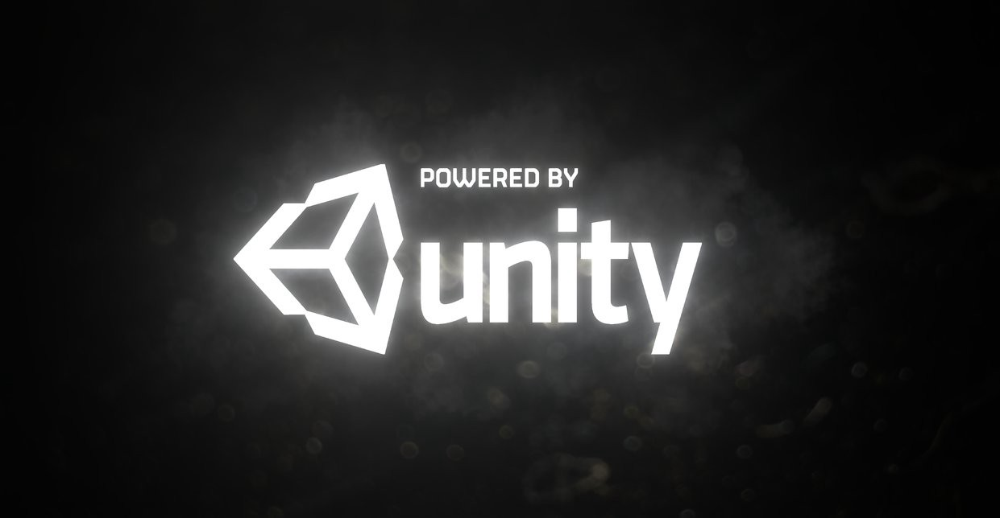
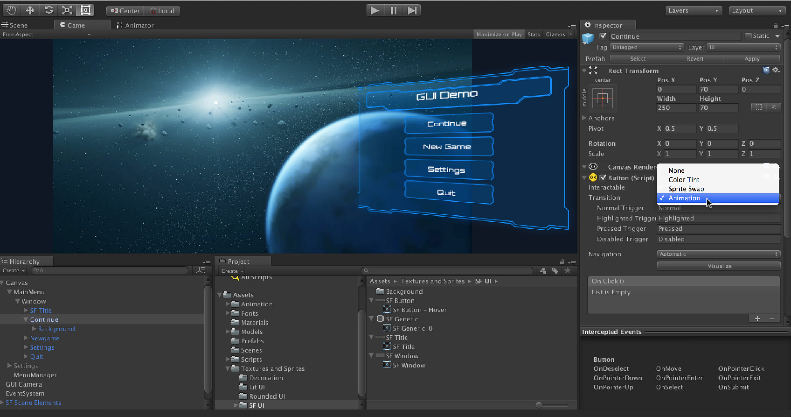
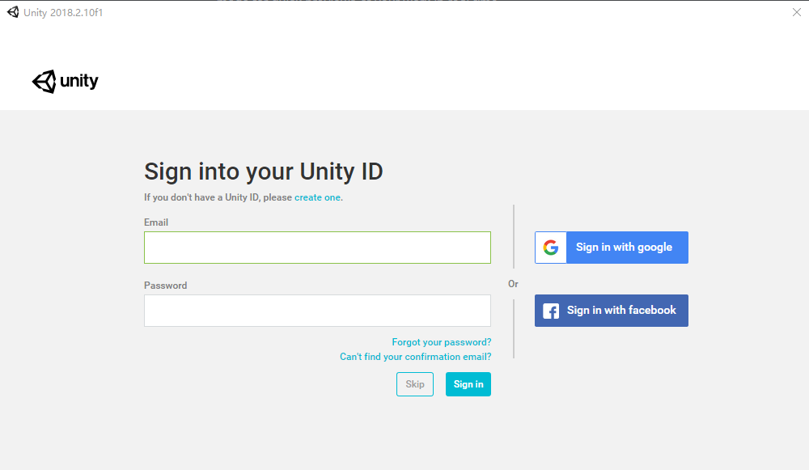
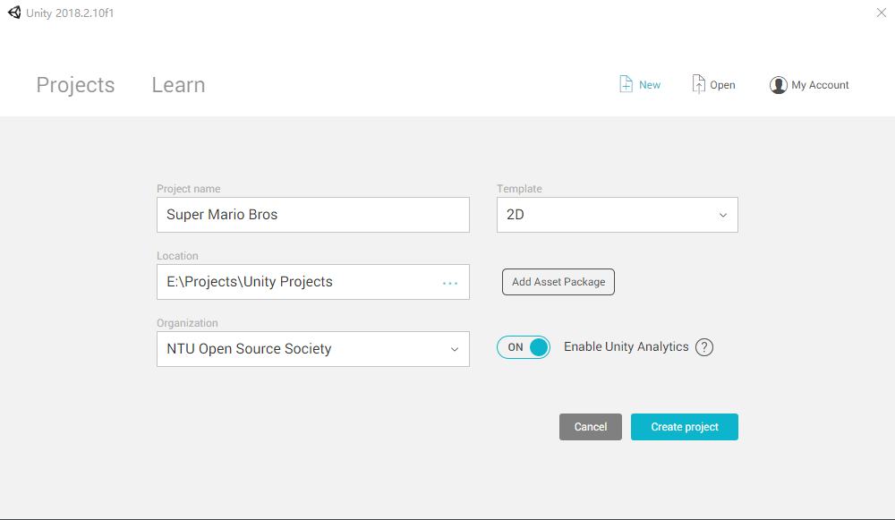
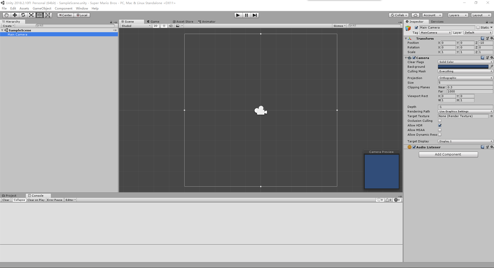
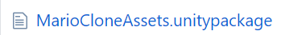
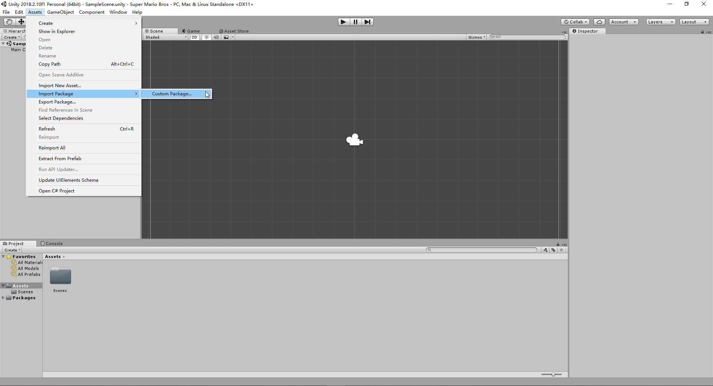

# NTUOSS Unity Workshop

##### *made with love by [Yong Hao](https://github.com/HORACEYOUNG) for NTU Open Source Society*

---

### Workshop Details

**When**: Friday, 12 Oct 2018. 6:30 PM - 8:30 PM.
**Where**: LT1, NTU North Spine Plaza
**Who**: NTU Open Source Society

**Questions**: We will be hosting a Pigeon Hole Live for collecting questions regarding the workshop.

Feedback & Error Reports: We will send out the link for collecting feedback as usual.
​	For further discussion or cooperation please contact YO0001AO@e.ntu.edu.sg.

***Disclaimer: This workshop is for educational purposes only. The artistic resources are retrieved from Nintendo Co., Ltd. and information regarding Unity concepts are retrieved from [Unity Manual](https://docs.unity3d.com/Manual/index.html). No prototype or outcome of any type is intended for commercial use.***

Tip: Search this Document with UnityConcept: “Search Term” to look for explanation. (First Letter Capitalized)
Eg. “UnityConcept: Asset”

---
### Prerequisites

1. **Unity Game Engine Software**

   [You can download Unity Personal Version by clicking this link.](https://store.unity.com/download?ref=personal)

   Unity Personal Version is free as long as the organization of the user does not make more than $100k in annual gross revenues.

   **Warning: We highly recommend you to download unity prior to coming to this workshop as it may take 30 - 60 minutes to complete the download. Also please register an account with Unity to login to the Unity software.**

2. **Visual Studio 2017 (or any other IDE you like for C# language)**

   Visual Studio 2017 is an integrated development environment (IDE) from Microsoft.

   As Unity Engine is based on C# language, Visual Studio 2017 serves this cause.

   We would recommend using Visual Studio 2017 for consistency because the speaker would use it and to prevent possible misunderstandings.

3. **Basic Object-Oriented Programming Knowledge (optional)**

---
## Task 0. Introduction

### What is Unity?

##### Unity is An all-in-one Editor that extends to match your production workflow

The Unity Editor features multiple tools that enable rapid editing and iteration in your development cycles, including Play mode for quick previews of your work in real-time.

- **All-in-one editor:** Available on Windows and Mac, it includes a range of artist-friendly tools for designing immersive experiences and game worlds, as well as a strong suite of developer tools for implementing game logic and high-performance gameplay.

- **2D & 3D:** Unity supports both 2D and 3D development with features and functionality for your specific needs across genres.

- **AI pathfinding tools:** Unity includes a navigation system that allows you to create NPCs that can intelligently move around the game world. The system uses navigation meshes that are created automatically from your Scene geometry, or even dynamic obstacles, to alter the navigation of the characters at runtime.

- **User interfaces:** Our built-in UI system allows you to create user interfaces fast and intuitively.

- **Physics engines:** Take advantage of Box2D and NVIDIA PhysX support for highly realistic and high-performance gameplay.

- **Custom tools:** You can extend the Editor with whatever tools you need to match your team’s workflow. Create and add customized extensions or find what you need on our Asset Store, which features thousands of resources, tools and extensions to speed up your projects.

### *Nearly Half of the games are made by Unity (Source: Unity Department of Propaganda)*
---
## Task 1. Create your first Project

​	When you first open unity, unity will ask you to log in (please register an account prior to the workshop or login with google or facebook accounts). 
​	

​	After you've logged in, you will be directed to the list of existing projects both local and on cloud, here we click on the **New** button to create a new project.

​	

​	The following information is required to create a new project:

- Project name: the name of your project;

- Location: where you want your project to be stored;

- Organization: which organization you belong to. Unity might use this data for its own business analytics.

- Template: the template for your game, available options can be 2D, 3D, 3D with extras etc. 

  Important: For this workshop, we will be using 2D template, make sure you have chosen the correct template.

- Add Asset Package: select the asset packages you want to initialize along with the project. Asset packages are collections of resources such as models, animations and audio for unity development use. For this tutorial we can ignore this since we will be manually importing our assets.

  With all information set, click on “Create Project” and let’s rock!

​	A new Unity window of your project will be opened. This could take a few seconds to minutes. It might seem overwhelming at first but don’t worry, we’ll go through them one by one.

---

## Task 2. Import Assets and Build the Scene

### [UnityConcept: Asset Package](https://docs.unity3d.com/Manual/AssetPackages.html)

> **Unity Asset Packages** and items on the Unity **Asset Store** are supplied in packages, which are **collections of files and data from Unity Projects**, or elements of Projects, which **are compressed and stored in one file**, similar to zip files. Like zip files.

​	For this Tutorial, we will be using an online package called [MarioCloneAssets.unitypackage](https://github.com/HORACEYOUNG/NTUOSS-UnityWorkshop/blob/master/MarioCloneAssets.unitypackage) under the root directory of the [workshop repository](https://github.com/HORACEYOUNG/NTUOSS-UnityWorkshop).

### Task2.1. Import the Asset Package to Your Project

There are to ways to import an asset package to your project:

1. From the top menu bar, choose Assets >> Import Package >> Custom Package
